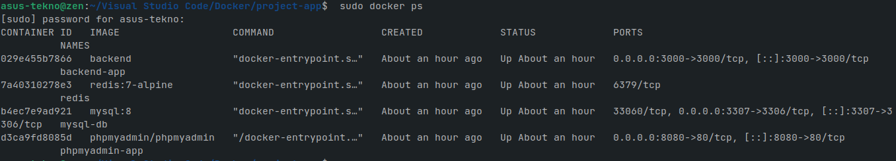
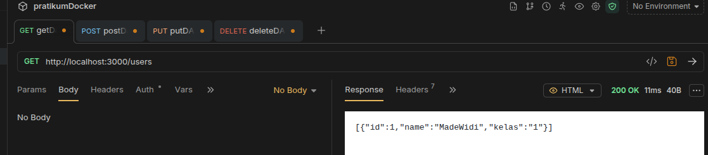
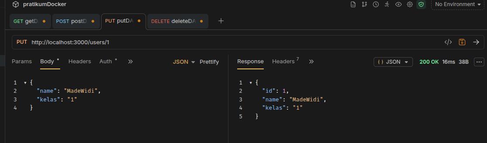

# Laporan Hasil Praktikum: Final Project Aplikasi Berbasis Container

## Identitas Mahasiswa

- **Nama:** I Made Widiarta
- **NIM:** 2415354027
- **Kelas/Rombel:** 4C
- **Tanggal Praktikum:** 20 Mei 2026

---

## Teknologi & Tools yang Digunakan

- **Sistem Operasi:** Linux Ubuntu
- **Containerization:** Docker & Docker Hub
- **Bahasa Pemrograman / Framework:** Node.js dan Javascript
- **Tools Lain:** VS Code, Git, Bruno

---

## Langkah-Langkah Praktikum & Dokumentasi

### Langkah 1: Membuat struktur folder project

```bash
project-app/
├── app/
│ ├── Dockerfile
│ ├── .dockerignore
│ ├── .env
│ ├── .env.example
│ ├── package.json
│ └── app.js
└── docker-compose.yml
```

### Langkah 2: Melakukan npm int dan menginstall depedensi

Lakukan npm init pada folder "app" pada project-app kita

```bash
# Contoh perintah terminal yang dijalankan
npm init -y .
```

---

### Langkah 3: Buat perintah services di docker-compose.yaml

Disini buat services dan download alat alat yang diperlukan seperti mysql, redis, phpmyadmin, dan nodejs untuk backend.

---

### Langkah 4: Buat juga aturan di Dockerfile

Aturan ini untuk menginstall image backend nantinya dimana dipakai node js alpine

**Dokumentasi/Screenshot:**


---

### Langkah 5: Buat juga .dockerignore

ini untuk mencegah packet packet ikut ke build di docker

---

### Langkah 6: Jalankan perintah docker compose untuk membuild docker

Perintah ini akan melakukan build docker secara otomatis sesuai aturan docker-compose.yaml tadi

```bash
# Contoh perintah terminal yang dijalankan
sudo docker compose up -d --build
```

### Langkah 6: Pengujian API

## Setelah backend selesai lalu lakukan pengujian api melalui tool khusus, seperti Bruno.

**Dokumentasi/Screenshot:**




---

## Kesimpulan

Kesimpulannya docker itu akan membungkus semua aplikasi kita dan juga nantinya aplikasi itu akan bisa dijalankan di perangkat lain karena packet packetnya semuanya sudah terinstall disana.
